# ¿Qué es "BOOKGEST"?

BOOKGEST es una aplicacion que facilita a Usuarios el adquirir un servicio de prestamo para libros por otra parte, permite a los trabajadores acceder a una plataforma de registro, editacion, eliminación y busqueda de usuarios, libros y prestamos, en especial el trabajador puede visualizar en tiempo real la informacion de los libros.

En el apartado de inicio, la app permite el registro de usuarios, y el ingreso de los mismo, el sistema redirecciona según el rol del usuario, tenemos tres direcciones:

Administrador: genera un formulario para el manejo de usuarios con la opcion de agregarle un rol (administrador, usuario, trabajador)

Trabajador: Formularios para registro, busqueda, eliminacion y modificacion de libros y prestamos, un formulario para solo agregar clientes con el rol de usuario por defecto, un listado de todos los libros

Usuario: Encontrará un boton para mostrar los libros que estan disponibles para prestar con su titulo, una descripcion corta y el id del libro además de eso, un boton de prestar que al oprimirlo genera un formulario de prestamo.

# Despliegue de la app:

***1. Clonar el Repositorio:*** Clona este repositorio en tu máquina local usando el comando:

```
git clone https://github.com/DiegoMartinez2094/Biblioteca_react.git
```

 ***2. Instalar Dependencias:*** Asegúrate de tener Node.js instalado en este caso se manejó el proyecto en la v18.16.0. Luego, desde la raíz del proyecto, abre la terminal y ejecuta el siguiente comando para instalar las dependencias:

```

npm install
```

***3. Configurar Variables de Entorno:*** Abre el archivo `.env.example` y verifica las variables de entorno necesarias para la conexión al servidor y a la base de datos en Atlas. Asegúrate de proporcionar los valores correctos para `My_server`, `ATLAS_USER`, `ATLAS_PASSWORD` y `ATLAS_DB`. y quita .example que el nombre del archivo sea solo `.env`

***4.Iniciar archivo:*** Ejecutamos la apicacion mediante el siguiente comando en la terminal:

```
npm run start
```

 La terminal nos mostrará la siguiente información:

```
> mi-aplicacion@1.0.0 start
> concurrently "npm run backend" "npm run frontend"

[0] 
[0] > mi-aplicacion@1.0.0 backend
[0] > nodemon --quiet app.js
[0] 
[1] 
[1] > mi-aplicacion@1.0.0 frontend
[1] > vite
[1] 
[1] 
[1]   VITE v4.4.10  ready in 226 ms
[1] 
[1]   ➜  Local:   http://localhost:5174/
[1]   ➜  Network: use --host to expose
[0] Servidor iniciado en http://127.10.10.10:5010
```

esta linea nos muestra cual es el host y el puerto que debemos abrir en nuestro navegador de preferencia Google Chrome

```
  ➜  Local:   http://localhost:5174/
```

# Diagramas de base de datos:

En este proyecto se usaron tres colecciones con su respectivo squema validador:

Coleccion usuario:

```
db.createCollection("user", {
  validator: {
    $jsonSchema: {
      bsonType: "object",
      required: [
        "User_id",
        "User_name",
        "Password",
        "Email",
        "Phone",
        "Address",
        "Role",
      ],
      properties: {
        User_id: {
          bsonType: "int",
          description: "User_id could be of int type and is required",
        },
        User_name: {
          bsonType: "string",
          description: "User_name could be of string type and is required",
        },
        Password: {
          bsonType: "string",
          description: "Password could be of string type and is required",
        },
        Email: {
          bsonType: "string",
          description: "Email could be of string type and is required",
        },
        Phone: {
          bsonType: "string",
          description: "Phone could be of string type and is required",
        },
        Address: {
          bsonType: "string",
          description: "Address could be of string type and is required",
        },
        Role: {
          bsonType: "string",
          description: "Role could be of string type and is required",
          enum: ["administrador", "trabajador", "usuario"],
        },
      },
    },
  },
});
```

Datos de prueba de la coleccion:

```
db.user.insertMany([
  {
    User_id: 1,
    User_name: "Diego",
    Password: "123",
    Email: "Diego@gmail.com",
    Phone: "1234567890",
    Address: "Dirección 1",
    Role: "administrador",
  },
  {
    User_id: 2,
    User_name: "Fernando",
    Password: "123",
    Email: "Fernando@gmail.com",
    Phone: "125454231564",
    Address: "Dirección 2",
    Role: "trabajador",
  },
  {
    User_id: 3,
    User_name: "Martineli",
    Password: "123",
    Email: "Martineli@gmail.com",
    Phone: "125454231564",
    Address: "Dirección 3",
    Role: "usuario",
  },
]);
```


Coleccion Libro:

```
db.createCollection("device",{
  validator: {
    $jsonSchema: {
      bsonType: "object",
      required: [
        "Device_id",
        "Device_name",
        "Description_device",
        "Device_category",
        "Device_status",
        "Device_cost",
      ],
      properties: { 
        Device_id: {
          bsonType: "int",
          description: "Device_id could be of int type and is required",
        },
        Device_name: {
          bsonType: "string",
          description: "Device_name could be of string type and is required",
        },
        Description_device: {
          bsonType: "string",
          description: "Description_device could be of string type and is required",
        },
        Device_category: {
          bsonType: "string",
          description: "Device_category could be of string type and is required",
        },
        Device_status: {
          bsonType: "string",
          description: "Device_status could be of string type and is required",
          enum: ["disponible", "prestado", "reservado"],
        },
        Device_cost: {
          bsonType: "int",
          description: "Device_cost could be of int type and is required",
        },
        Device_comments: {
          bsonType: "string",
          description: "Device_comments could be of string type and is required",
        }
       }
    } 
  }
})
```

Datos de prueba de la coleccion::

```
db.device.insertMany([{
  Device_id: 1,
  Device_name: "cien años de soledad",
  Description_device: "La novela mezcla elementos de realismo mágico con la historia de Colombia y presenta una narrativa que se centra en temas como el amor, la soledad, la violencia, la política y la búsqueda de la identidad",
  Device_category: "realismo mágico",
  Device_status:"disponible",
  Device_cost:20000,
  Device_comments:"Buen libro"
},
{
  Device_id: 2,
  Device_name: "El señor de los anillos",
  Description_device: "Una épica historia de fantasía que sigue las aventuras de Frodo Bolsón, un hobbit que debe destruir el Anillo Único, una poderosa arma creada por el Señor Oscuro Sauron.",
  Device_category: "fantasía",
  Device_status: "disponible",
  Device_cost: 30000,
  Device_comments: "Una obra maestra de la literatura fantástica."
},
{
  Device_id: 3,
  Device_name: "El Quijote",
  Description_device: "La historia de Don Quijote de la Mancha, un hidalgo manchego que se embarca en una serie de aventuras junto a su escudero Sancho Panza.",
  Device_category: "clásico",
  Device_status: "disponible",
  Device_cost: 20000,
  Device_comments: "Una obra maestra de la literatura universal."
},
{
  Device_id: 4,
  Device_name: "Pedro Páramo",
  Description_device: "La historia de Juan Preciado, un hombre que viaja a Comala, su pueblo natal, en busca de su padre, Pedro Páramo, un terrateniente poderoso y temido.",
  Device_category: "realismo mágico",
  Device_status: "disponible",
  Device_cost: 20000,
  Device_comments: "Una obra maestra de la literatura mexicana."
},{
  Device_id: 5,
  Device_name: "La casa de los espíritus",
  Description_device: "La historia de tres generaciones de mujeres de una familia de la alta sociedad chilena, desde el siglo XIX hasta el golpe de Estado de 1973.",
  Device_category: "realismo mágico",
  Device_status: "disponible",
  Device_cost: 25000,
  Device_comments: "Una obra maestra de la literatura latinoamericana."
},
{
  Device_id: 6,
  Device_name: "El amor en los tiempos del cólera",
  Description_device: "La historia de amor de Florentino Ariza y Fermina Daza, que se extiende durante más de 50 años.",
  Device_category: "realismo mágico",
  Device_status: "disponible",
  Device_cost: 20000,
  Device_comments: "Una historia de amor inolvidable."
},{
  Device_id: 7,
  Device_name: "Harry Potter y la piedra filosofal",
  Description_device: "La historia de un niño huérfano que descubre que es un mago y es aceptado en el Colegio Hogwarts de Magia y Hechicería.",
  Device_category: "fantasía",
  Device_status: "disponible",
  Device_cost: 25000,
  Device_comments: "Una serie de libros inolvidable."
},
{
  Device_id: 8,
  Device_name: "El hobbit",
  Description_device: "La historia de Bilbo Bolsón, un hobbit que se embarca en una aventura para recuperar el tesoro del dragón Smaug.",
  Device_category: "fantasía",
  Device_status: "disponible",
  Device_cost: 20000,
  Device_comments: "Una historia clásica de fantasía."
},
{
  Device_id: 9,
  Device_name: "La Odisea",
  Description_device: "La historia del viaje de regreso de Odiseo, rey de Ítaca, a su patria después de la Guerra de Troya.",
  Device_category: "clásico",
  Device_status: "disponible",
  Device_cost: 20000,
  Device_comments: "Una obra maestra de la literatura universal."
},
{
  Device_id: 10,
  Device_name: "Hamlet",
  Description_device: "La historia de un príncipe danés que se venga de la muerte de su padre.",
  Device_category: "clásico",
  Device_status: "disponible",
  Device_cost: 25000,
  Device_comments: "Una tragedia clásica de Shakespeare."
}
])
```

Coleccion Prestamo:

```
db.createCollection("loan",{
  validator: {
    $jsonSchema: {
      bsonType: "object",
      required: [
        "Loan_ID",
        "User_ID",
        "Device_id",
        "Loan_Date",
        "Expected_Return_Date",
        "Loan_Status",
        "Physical_Condition_Before",
      ],
      properties: { 
        Loan_ID: {
          bsonType: "int",
          description: "Loan_ID could be of int type and is required",
        },
        User_ID: {
          bsonType: "int",
          description: "User_ID could be of int type and is required",
        },
        Device_id: {
          bsonType: "int",
          description: "Device_id could be of int type and is required",
        },
        Loan_Date: {
          bsonType: "string",
          description: "Loan_Date could be of date type and is required",
        },
        Expected_Return_Date: {
          bsonType: "string",
          description: "Expected_Return_Date could be of date type and is required",
        },
        Actual_Return_Date: {
          bsonType: "string",
          description: "Actual_Return_Date could be of date type and is required",
        },
        Loan_Status : {
          bsonType: "string",
          description: "Loan_Status could be of string type and is required",
          enum: ["pendiente", "entregado", "reservado"],
        },
        Loan_Comments : {
          bsonType: "string",
          description: "Loan_Comments  could be of string type",
        },
        Physical_Condition_Before  : {
          bsonType: "string",
          description: "Physical_Condition_Before  could be of string type and is required",
          enum: ["Bien", "desgastado", "dañado", ""],
        },
        Physical_Condition_After  : {
          bsonType: "string",
          description: "Physical_Condition_After  could be of string type and is required",
          enum: ["Bien", "desgastado", "dañado", ""],
        }
       }
    } 
  }
})
```

Datos de prueba:

```
db.loan.insertMany([{
  Loan_ID: 1,
  User_ID: 1,
  Device_id: 1,
  Loan_Date: "2023-09-29T00:00:00.000Z",
  Expected_Return_Date: "2023-09-29T00:00:00.000Z",
  Actual_Return_Date: "2023-09-29T00:00:00.000Z",
  Loan_Status: "entregado",
  Loan_Comments: "Buen libro",
  Physical_Condition_Before: "Bien",
  Physical_Condition_After: "desgastado"
},
{
  Loan_ID: 2,
  User_ID: 2,
  Device_id: 2,
  Loan_Date: "2023-09-29T00:00:00.000Z",
  Expected_Return_Date: "2023-09-29T00:00:00.000Z",
  Actual_Return_Date: "2023-09-29T00:00:00.000Z",
  Loan_Status: "entregado",
  Loan_Comments: "no me gustó",
  Physical_Condition_Before: "Bien",
  Physical_Condition_After: "Bien"
}
])
```


# Visualiza la app y su funcionalidad

En primer lugar encontramos la pagina de home: 


En el encontraremos  El nombre de nuestra Aplicacion y dos botones, el boton registro direccionará a un formulario de registro de usuario (Cliente):

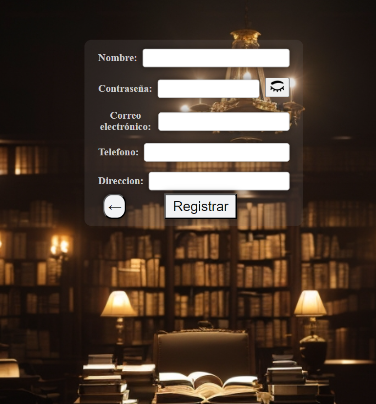

Cualquier error o respuesta ok que tengamos en en nuestros sistema se verá reflejado por unos mensajes  como el siguiente:

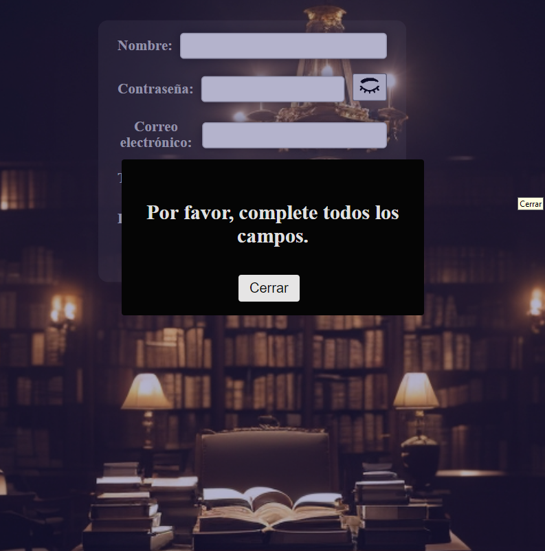

si ponemos un dato que no concuerda con el formato de correo electronico nos envia el siguiente mensaje :
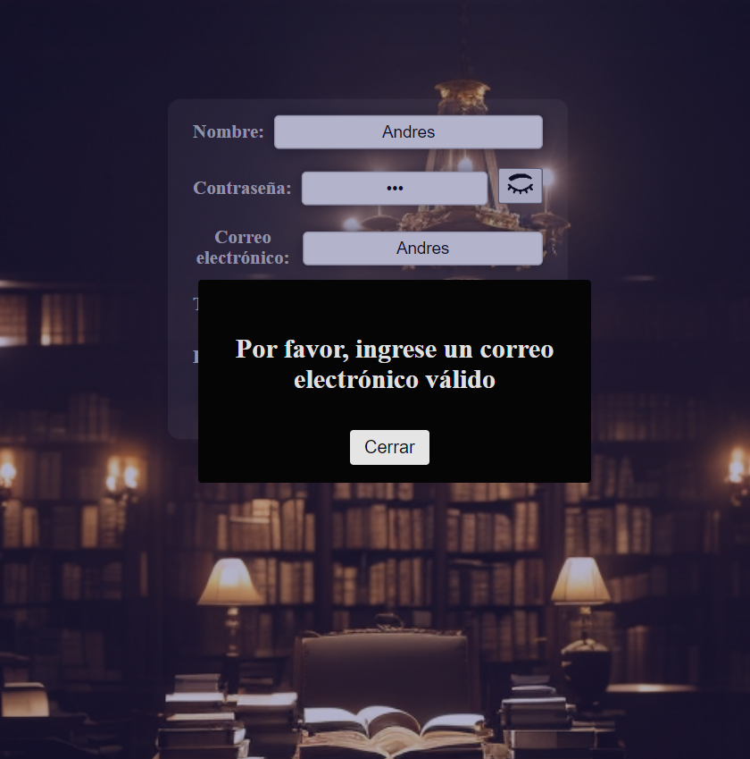

Si ingresamos un correo electronico que ya esté en uso por otro usuario nos mostrará el siguiente mensaje :


En el apartado del formulario podemos encontrar 3 botones, para visualizar la contraseña, para realizar el registro y para volver a la pag principal: 

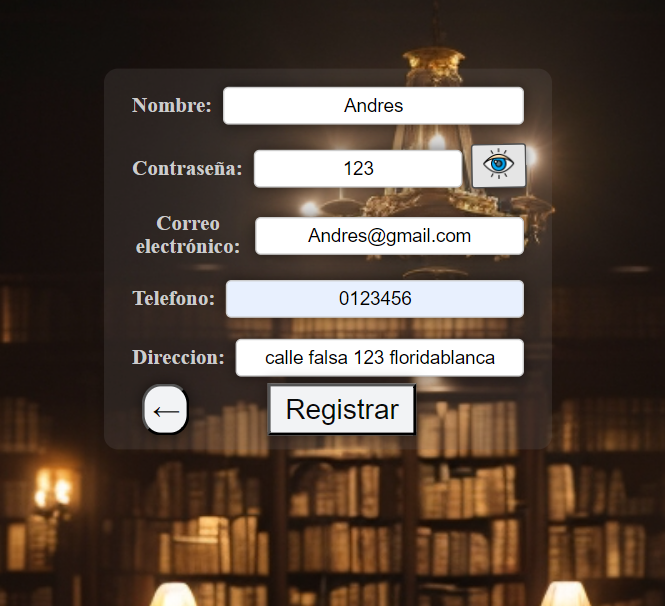

Si ingresamoslos datos correctamente y procedemos a ingresar nos saldrá el siguiente mensaje:

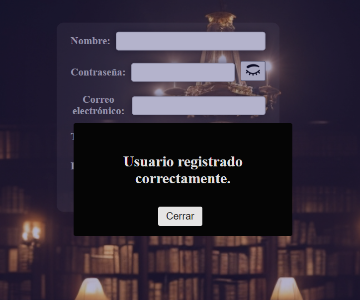

seguido de ello vamos al boton de la flecha que nos indica volver a la pabtalla principal y orpimimos ingresar, de igual forma si los campos no están completos nos saldrá el mensaje de completar todos los Campos,

Si ingresamos uno de los dos datos incorrectos saldrá el siguiente mensaje:


Si ingresamos los dos datos incorrectos, nos mostrará el siguiente mensaje: 

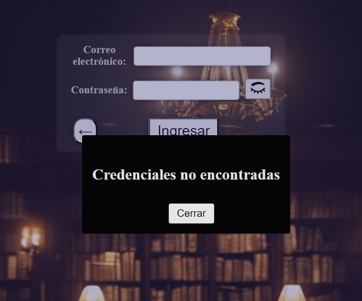

Cuando ingresamos los datos correctamente, nos redireccionará a  la paginade userpag:


en ella encontraremos tres botones con sus respectivos nombres muy intuitivos, el boton de mostrar libros, nos dejará visualizar todos los libros disponibles para prestamo: 

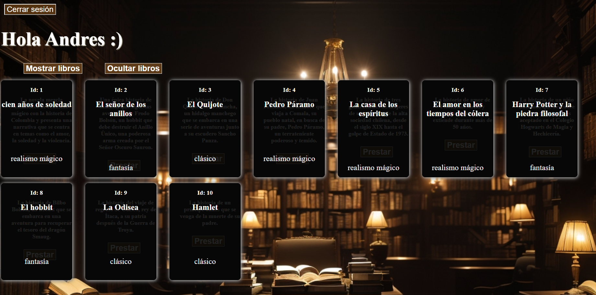

si localizamos el mouse sobre uno de los libro, nos dejará visualizar un breve resumen y un boton con la opcion de prestamo:


En este caso visualizamos el libro numero 4  de Pedro Páramo, al oprimir el boton prestar nos mostrará un formulario dragable con tres inputs y dos botones, 1 es para cancelar la operación y el otro para confirmar el prestamo, debemos :

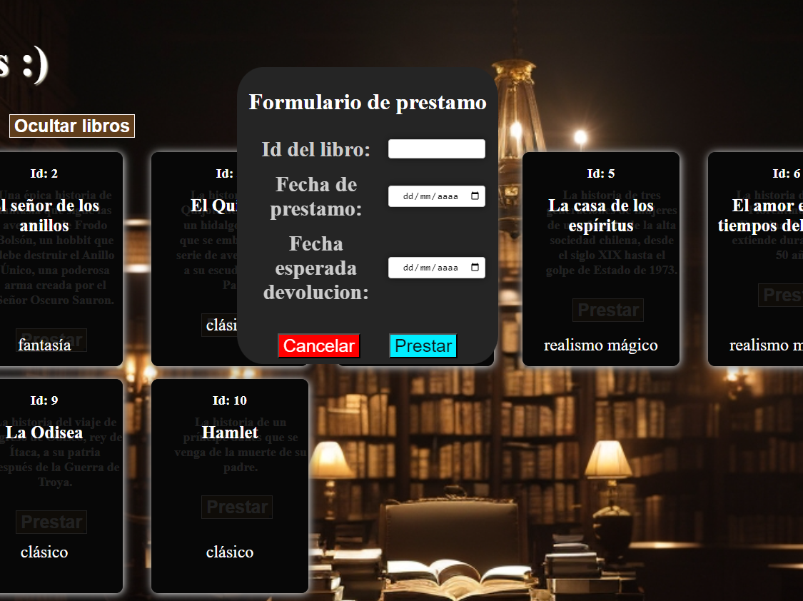

el formulario verifica que todos los campos esten llenos y que la fecha de prestamo sea menor a fecha espedada de devolucion cuando pasa todas las validaciones, se mostrará un mensaje de confirmacion de prestamo y si volvemos a mostrar los libros, podrémos ver que ya el libro 4 no está disponible: 

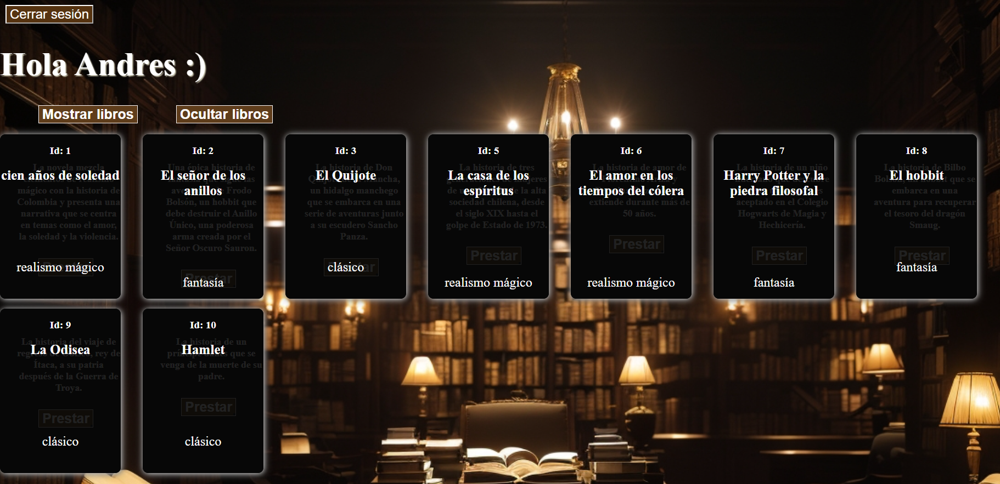

Posterior a eso oprimimos el boton de cerrar sesión y podemos verificar con el link de /userpag que las credenciales del cliente ya no están:


si oprimimos en el mensaje nos redireccionará a la pagina de inicio de sesión.

Lo anterior fue en el apartado de Cliente.

---

Ahora veremos el apartado del trabajador:

Empezamos ingresando las credeciales de un usuario con el rol trabajador registrado con anterioridad por el Administrador, más adelante se explicará como trabaja el administrador.


Esta es la Worker page, en esta encontraremos unos botones con sus respectivas funciones muy predecibles.

En el apartado de Registro de libros encontramos un formulario con 4 botones cada uno con una función especifica y sus respesctivas validaciones:

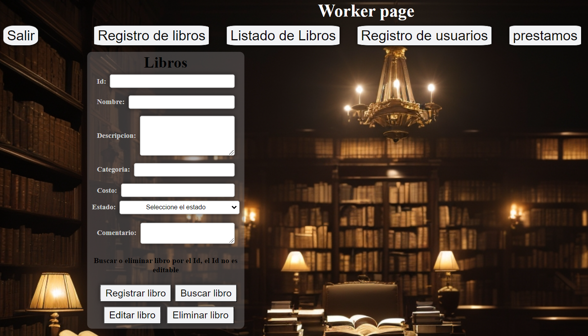

En este caso probaremos el de Editar libro, para ello primero debemos buscar un libro por su id pero para ello está el segundo botón que nos mostrará una tabla con toda la información de los libros, para este ejemplo utilizaremos el id numero 1 y oprimimos el boton buscar: 

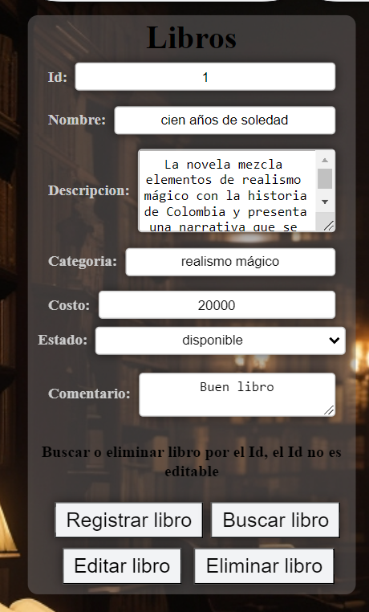

nos mostrará toda la información del libro editable excepto el id, cambiaremos el apartado de comentarios, segudo de oprimir el boton editar:

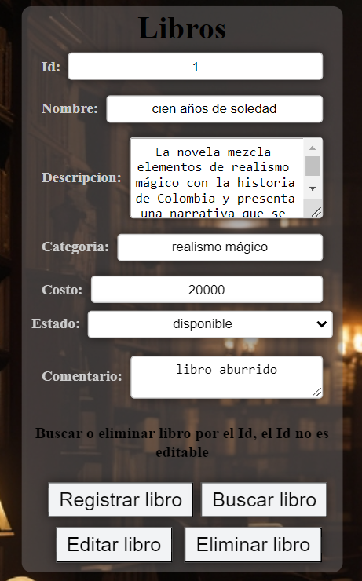

Nos mostrará un mensaje de confirmación de la actividad, y nos dejará el formulario limpio, así en todas las operaciones.

Ahora seguimos con el apartado de listado de libros, al oprimir el boton visualizaremos todos los libros registrados con su respectiva informacion y un boton de refresco de tabla:

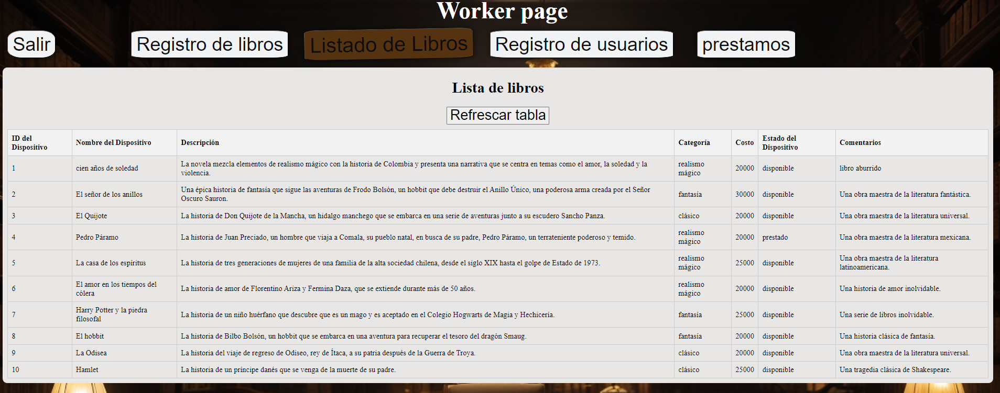

Seguimos con el apartdado de Registro de usuarios que es igual al de la pagina de inicio:

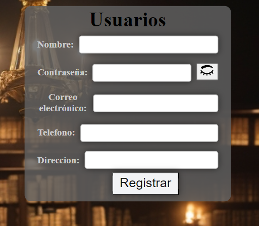

Por ultimo encontramos el apartado de prestamos: 

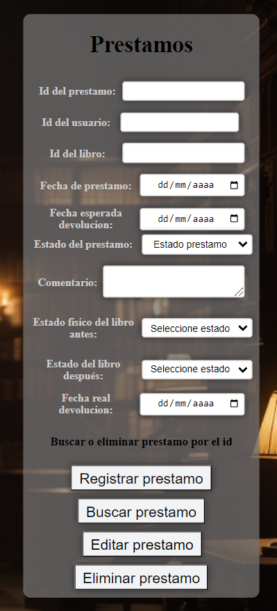

---

Por último pero no menos importante el apartado del Administrador, cuando ingresamos las credenciales del administrador encontramos un formulario que maneja las operaciones de editar, buscar, registrar y eliminar usuarios :

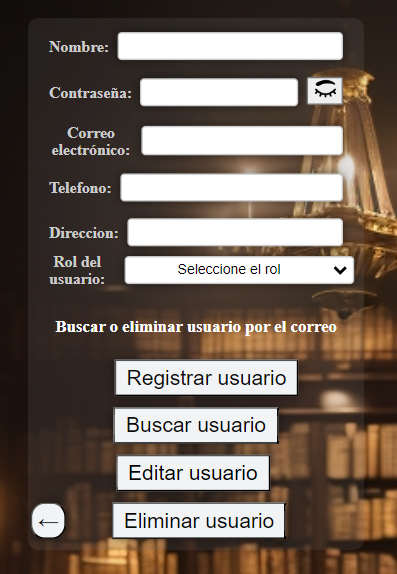

En este apartado podemos ver que podemos poner el rol que queramos (administrador, trabajador o usuario ) el super admin es Diego@gmail.com ya que no puede ser eliminado ni editado
